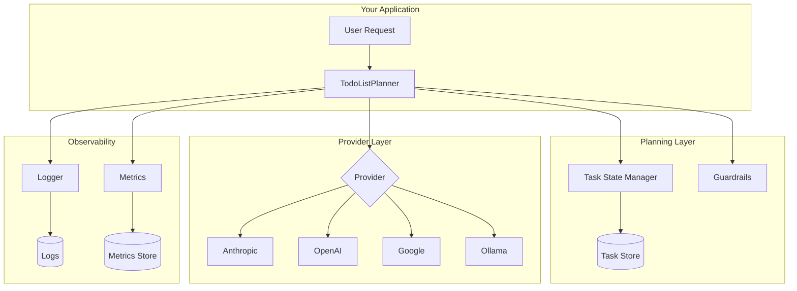

# Agent Task Planning

[](https://github.com/PDATaskForce/agent-task-planning/actions/workflows/ci.yml)
[](https://www.python.org/downloads/)
[](https://opensource.org/licenses/MIT)

**Production-ready task planning for AI agents. From demo to deployment.**

A framework-agnostic Python library that gives any LLM explicit planning capabilities with built-in guardrails, observability, and multi-provider support.

> **Developed by members of the PDA Task Force**
>
> Part of the [PDA Platform](https://github.com/PDA-Task-Force/pda-platform).
>
> Free to use under MIT license. Attribution appreciated.

## Why Planning Matters

Most AI agent pilots fail not because the technology isn't smart enough, but because nobody asked: "Can we actually verify what it's doing?"

| Without Planning | With Planning |
|------------------|---------------|
| Agent attempts everything at once | Agent creates explicit task breakdown |
| Failures are opaque | Progress is visible and auditable |
| Context gets lost in long tasks | State persists across steps |
| Difficult to interrupt or redirect | Easy to pause, review, adjust |
| "Black box" decision-making | Transparent reasoning trail |

This library implements the **To-Do List Planning** pattern, which research shows is optimal for multi-step workflows requiring visibility and control.

## Features

- **Multi-provider support**: Claude, GPT-4, Gemini, Ollama (local models)
- **Production guardrails**: Iteration limits, cost caps, timeouts, validation
- **Full observability**: Structured logging, token tracking, state history
- **Framework-agnostic**: Use standalone or integrate with LangChain, Temporal, etc.
- **Type-safe**: Full type hints, Pydantic models, runtime validation
- **Confidence extraction**: Self-consistency sampling for reliable structured data extraction from PM documents (see [docs/confidence-extraction.md](docs/confidence-extraction.md))
- **Outlier mining**: Discover diverse approaches and novel insights by treating outliers as signal rather than noise (see [docs/outlier-mining.md](docs/outlier-mining.md))

## Quick Start

### Installation

```bash
pip install agent-task-planning
```

Or install from source:

```bash
git clone https://github.com/PDATaskForce/agent-task-planning.git
cd agent-task-planning
pip install -e ".[all]"
```

### Basic Usage

```python
from agent_planning import TodoListPlanner
from agent_planning.providers import AnthropicProvider

# Initialise with your preferred provider
provider = AnthropicProvider(api_key="your-api-key")
planner = TodoListPlanner(provider=provider)

# Execute a complex task
result = await planner.execute(
    "Research the top 3 competitors in the UK sports broadcasting market, "
    "analyse their AI capabilities, and summarise findings"
)

# Access the execution trace
for task in result.tasks:
    print(f"[{task.status.value}] {task.content}")
```

### With Guardrails

```python
from agent_planning import TodoListPlanner, GuardrailConfig
from agent_planning.providers import OpenAIProvider

planner = TodoListPlanner(
    provider=OpenAIProvider(api_key="your-api-key"),
    guardrails=GuardrailConfig(
        max_tasks=15,
        max_iterations=50,
        max_cost_usd=1.00,
        timeout_seconds=300,
        require_approval_for=["delete", "send", "publish"]
    )
)
```

### Using Local Models (Ollama)

```python
from agent_planning.providers import OllamaProvider

provider = OllamaProvider(
    model="llama3.1:70b",
    base_url="http://localhost:11434"
)
planner = TodoListPlanner(provider=provider)
```

### Command Line Demo

```bash
python scripts/demo.py "Research AI planning patterns and summarise"
python scripts/demo.py --provider ollama --model llama3.1:8b "List 3 benefits of exercise"
```

### Confidence Extraction (New)

Extract reliable structured data from PM documents using self-consistency:

```python
from agent_planning import ConfidenceExtractor, SchemaType
from agent_planning.providers import AnthropicProvider

provider = AnthropicProvider(api_key="your-key")
extractor = ConfidenceExtractor(provider)

result = await extractor.extract(
    query="What are the top 5 risks for this project?",
    context=project_document,
    schema=SchemaType.RISK,
)

print(f"Confidence: {result.confidence:.2%}")
print(f"Review needed: {result.review_level.value}")
```

### Outlier Mining (New)

Discover diverse approaches by mining outliers as signal:

```python
from agent_planning import OutlierMiner, MiningConfig
from agent_planning.providers import AnthropicProvider

provider = AnthropicProvider(api_key="your-key")
miner = OutlierMiner(provider, MiningConfig(samples=32))

result = await miner.mine(
    query="What non-obvious risks might affect this project?",
    context=project_document,
    schema=SchemaType.RISK,
)

print(f"Found {result.num_clusters} distinct approaches")
print(f"Diversity: {result.diversity_score:.2f}")
```

## Architecture



See [docs/architecture.md](docs/architecture.md) for detailed diagrams and explanations.

## Planning Patterns

This library focuses on **To-Do List Planning**, but it's important to understand when other patterns are more appropriate:

| Pattern | Best For | This Library |
|---------|----------|--------------|
| No Planning | Simple Q&A | Not needed |
| ReAct | Linear tool-using tasks | Partial support |
| Chain-of-Thought | Complex reasoning | Use prompts only |
| Tree-of-Thought | Exploratory/creative | Not implemented |
| **To-Do List** | Multi-step workflows | ✅ Full support |
| HTN | Complex dependencies | Roadmap |

See [docs/when-to-use-what.md](docs/when-to-use-what.md) for a complete decision guide.

## The Fundamental Trade-off

LLM-based planning is **probabilistic**:

| Dimension | Deterministic (Airflow, etc.) | Probabilistic (This library) |
|-----------|-------------------------------|------------------------------|
| Reproducibility | Guaranteed | Not guaranteed |
| Testing | Exhaustive possible | Statistical only |
| Flexibility | Low | High |
| Novel situations | Cannot handle | Can adapt |
| Certification | Straightforward | Challenging |

**When to use this library:**
- Research and exploration tasks
- Creative work requiring adaptation
- Internal productivity tools
- Prototyping agent workflows

**When to use deterministic orchestration instead:**
- Regulated industries requiring audit trails
- Financial transactions
- Safety-critical operations
- High-volume processing where consistency matters

For safety-critical applications, consider the [hybrid approach](examples/04_temporal_hybrid.py) combining deterministic orchestration with probabilistic subtasks.

## Documentation

### Core Features
- [Architecture and Diagrams](docs/architecture.md)
- [When to Use What](docs/when-to-use-what.md)
- [Cost Considerations](docs/cost-considerations.md)
- [Troubleshooting](docs/troubleshooting.md)

### PM Data Extraction
- [Confidence Extraction](docs/confidence-extraction.md) - Technical documentation for reliable structured data extraction
- [Confidence for Practitioners](docs/confidence-for-practitioners.md) - Non-technical guide for PM professionals
- [Outlier Mining](docs/outlier-mining.md) - Discover diverse approaches and novel insights

## Prompt Templates

If you just want the prompts without the library:

- [Basic Planning Prompt](prompts/basic-planning.md)
- [Production Planning Prompt](prompts/production-planning.md)
- [Minimal Planning Prompt](prompts/minimal-planning.md)

## Examples

### Task Planning
| Example | Description |
|---------|-------------|
| [01_basic_usage.py](examples/01_basic_usage.py) | Simple task execution |
| [02_multi_provider.py](examples/02_multi_provider.py) | Switching between Claude, GPT-4, Gemini |
| [03_with_guardrails.py](examples/03_with_guardrails.py) | Production configuration |
| [04_temporal_hybrid.py](examples/04_temporal_hybrid.py) | Deterministic orchestration pattern |

### Confidence Extraction
| Example | Description |
|---------|-------------|
| [05_basic_confidence.py](examples/05_basic_confidence.py) | Simple confidence extraction |
| [06_pm_extraction.py](examples/06_pm_extraction.py) | Multiple PM schema types |
| [07_batch_confidence.py](examples/07_batch_confidence.py) | Batch processing with concurrency |
| [08_custom_schema.py](examples/08_custom_schema.py) | Custom schema definition |

### Outlier Mining
| Example | Description |
|---------|-------------|
| [09_basic_mining.py](examples/09_basic_mining.py) | Mining for diverse approaches |
| [10_risk_mining.py](examples/10_risk_mining.py) | Mining for non-obvious risks |

## Supporting Research

This library implements patterns validated by recent research:

- **"Adaptation of Agentic AI"** (Stanford, Harvard, UC Berkeley, Caltech, Dec 2024) identifies unreliable tool use, weak long-horizon planning, and poor generalisation as core failure modes. Structured planning directly addresses these. [arxiv.org/abs/2512.16301](https://arxiv.org/abs/2512.16301)

## Coming Soon: ARMM

The **Agent Reliability Maturity Model (ARMM)** is a comprehensive framework for assessing organisational readiness for agent deployment. ARMM provides specific requirements across four dimensions:

- Technical Controls
- Operational Processes
- Governance Framework
- Organisational Capability

## Contributing

We welcome contributions! See [CONTRIBUTING.md](CONTRIBUTING.md) for guidelines.

This project is maintained by the [PDA Task Force](https://github.com/PDATaskForce). Issues and pull requests are reviewed by community maintainers.

## Acknowledgements

The confidence extraction and outlier mining capabilities were shaped by feature suggestions from [Lawrence Rowland](https://github.com/lawrencerowland).

## License

MIT License. Free to use, modify, and distribute with attribution.

See [LICENSE](LICENSE) for details.

## Attribution

**Developed by:** Members of the PDA Task Force

**Maintained by:** [PDA Task Force](https://github.com/PDATaskForce) — Advancing best practices in project data analytics and AI deployment.

---

*If this library helps you, consider giving it a ⭐ on GitHub.*
