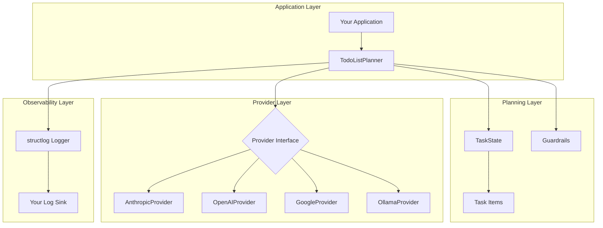
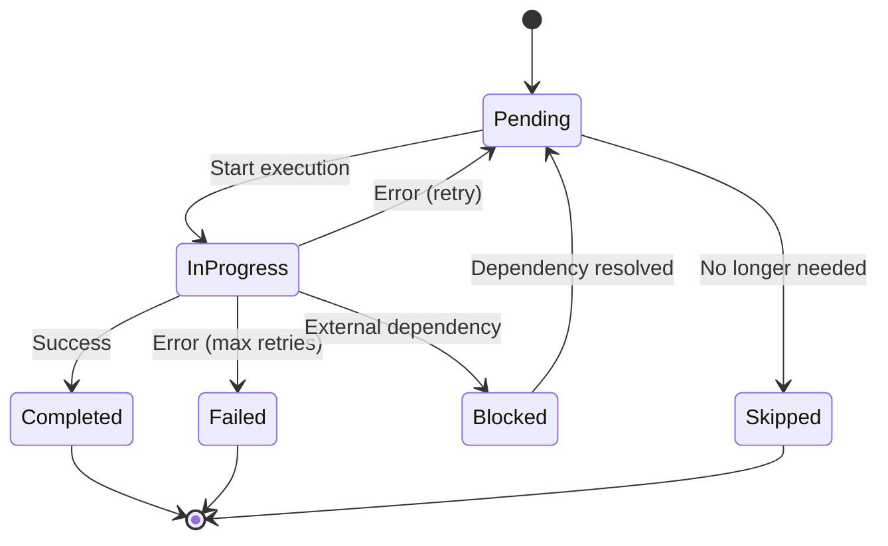
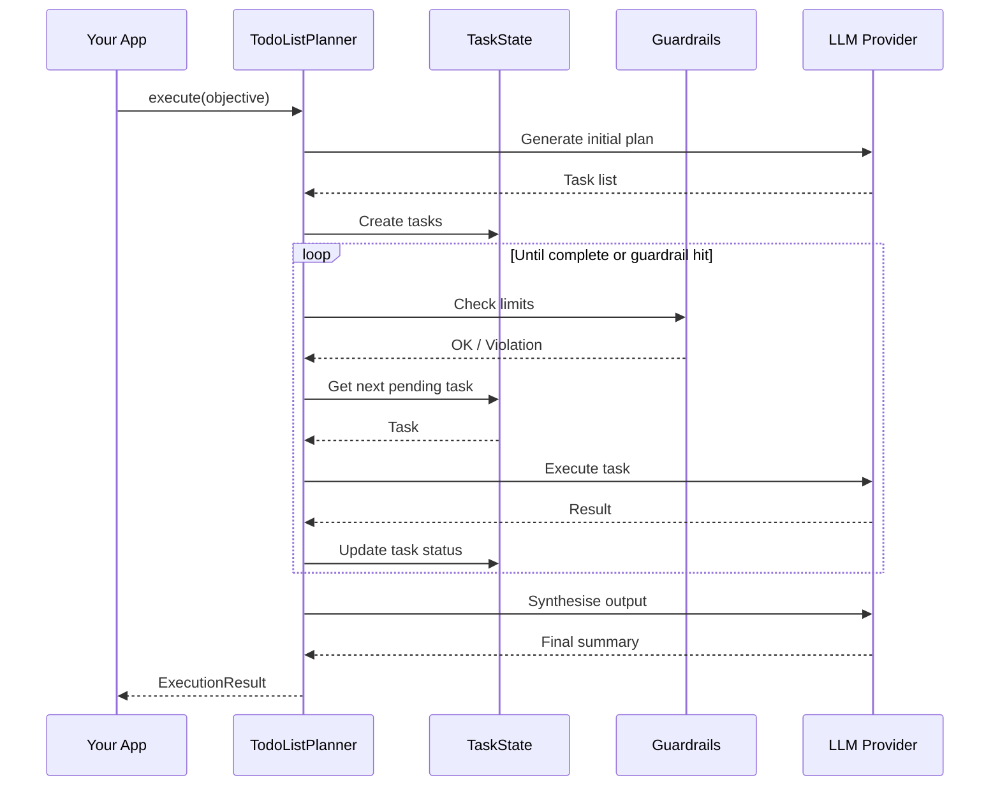

# Architecture

This document explains the architecture of `agent-task-planning` and the design decisions behind it.

> Developed by [Members of the PDA Task Force](https://PDA Platform.co.uk) for the [PDA Task Force](https://github.com/PDATaskForce)

## High-Level Overview



## Component Details

### Task State Management



### Execution Flow



## Design Principles

### 1. Provider Agnostic

The library uses an abstract `BaseProvider` interface, allowing any LLM to be used:

- No vendor lock-in
- Easy to switch providers
- Test with cheap/local models, deploy with powerful ones
- Support for future providers

### 2. Guardrails First

Production deployments need hard limits. Our guardrails are:

- **Non-bypassable**: Once configured, they cannot be overridden by the agent
- **Composable**: Mix and match limits, validators, and approval gates
- **Observable**: All violations are logged

### 3. Explicit State

Unlike ReAct patterns where state is implicit in the conversation, we maintain explicit `TaskState`:

- Survives context window limits
- Can be persisted externally
- Enables pause/resume
- Supports human intervention

### 4. Minimal Dependencies

Core library has minimal dependencies:

- `pydantic` for data validation
- `httpx` for HTTP
- `structlog` for logging

Provider SDKs are optional extras.

## Comparison with Alternatives

| Feature | This Library | LangChain | AutoGen | CrewAI |
|---------|--------------|-----------|---------|--------|
| Planning pattern | To-Do List | Various | Conversation | Role-based |
| State management | Explicit | Implicit | Conversation | Agent memory |
| Guardrails | Built-in | Callbacks | Limited | Limited |
| Provider support | 4+ | Many | OpenAI focus | OpenAI focus |
| Complexity | Low | High | Medium | Medium |
| Production-ready | Yes | Requires work | Limited | Limited |

## Extension Points

### Custom Providers

Implement `BaseProvider`:

```python
class MyProvider(BaseProvider):
    async def complete(self, messages, system=None, **kwargs):
        # Your implementation
        return ProviderResponse(...)

    @property
    def name(self):
        return "my-provider"
```

### Custom Guardrails

Add validators:

```python
def my_validator(content: str, config: GuardrailConfig):
    if "dangerous" in content:
        raise GuardrailViolation("Content is dangerous")
```

### Custom Planning Prompts

Pass a custom system prompt:

```python
planner = TodoListPlanner(
    provider=provider,
    system_prompt="Your custom planning instructions..."
)
```
