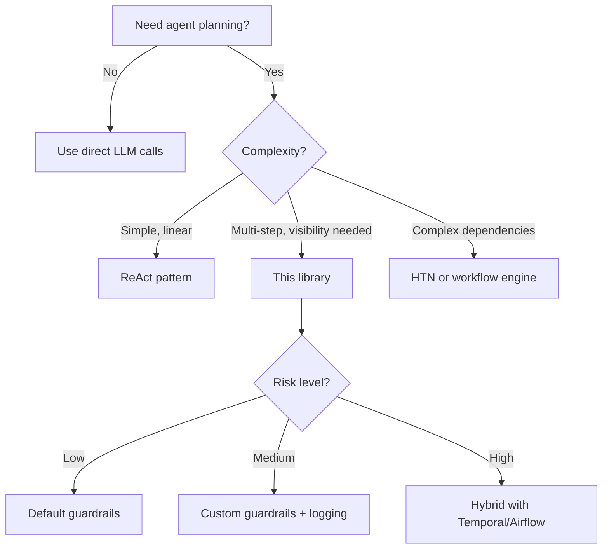

# Decision Guide: Choosing the Right Planning Pattern

> Developed by [Members of the PDA Task Force](https://PDA Platform.co.uk) for the [PDA Task Force](https://github.com/PDATaskForce)

## Quick Reference

| Situation | Recommended Pattern |
|-----------|---------------------|
| Simple question | No planning needed |
| Linear multi-step task | ReAct |
| Complex reasoning | Chain-of-Thought |
| Exploratory/creative | Tree-of-Thought |
| Long-running with visibility | **To-Do List (this library)** |
| Complex dependencies | HTN |
| Safety-critical workflow | Deterministic orchestration + agents |

## Decision Flowchart

## Detailed Guidance

### No Planning Needed

**Use when:**
- Single-step responses
- Simple Q&A
- Quick lookups or calculations

**Example:** "What's the capital of France?"

---

### ReAct (Reasoning + Acting)

**Use when:**
- Tasks where each step informs the next
- Tool-using agents with clear sequences

**Example:** "Find the weather in London and suggest what to wear"

**Limitation:** Can lose track in very long sequences.

---

### Chain-of-Thought

**Use when:**
- Multi-step logic problems
- Mathematical reasoning

**Example:** "Calculate the ROI of this investment over 5 years"

**Limitation:** Linear, doesn't explore alternatives.

---

### Tree-of-Thought

**Use when:**
- Creative tasks with multiple valid approaches
- Problems requiring exploration

**Example:** "Generate three different marketing strategies and evaluate each"

**Limitation:** Higher token cost, slower execution.

---

### To-Do List Planning (This Library)

**Use when:**
- Multi-step workflows
- Long-running operations
- User needs visibility into progress
- Tasks might be interrupted
- Human oversight required

**Example:** "Research competitors, analyse pricing, draft report"

**Strengths:**
- Explicit progress tracking
- Pause and resume capability
- Easy human intervention
- Clear audit trail

---

### Hierarchical Task Networks (HTN)

**Use when:**
- Complex projects with many interdependencies
- Domain expertise can be encoded upfront

**Example:** "Plan and execute a product launch"

**Limitation:** Requires significant upfront structure.

---

### Hybrid (Deterministic + Probabilistic)

**Use when:**
- Production systems requiring guarantees
- Regulated environments
- Safety-critical operations

**Example:** Live broadcast captioning, financial document processing

See `examples/04_temporal_hybrid.py` for implementation.

## Risk-Based Selection

| Risk Level | Examples | Recommendation |
|------------|----------|----------------|
| Low | Personal productivity, exploration | Basic To-Do List |
| Medium | Internal tools, draft generation | To-Do List + guardrails |
| High | User-facing products, data processing | Full guardrails + logging |
| Critical | Regulated industries, financial | Hybrid architecture |
